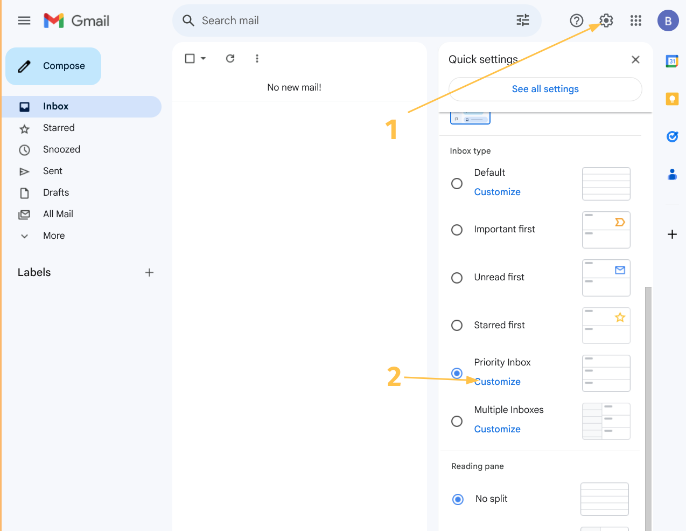
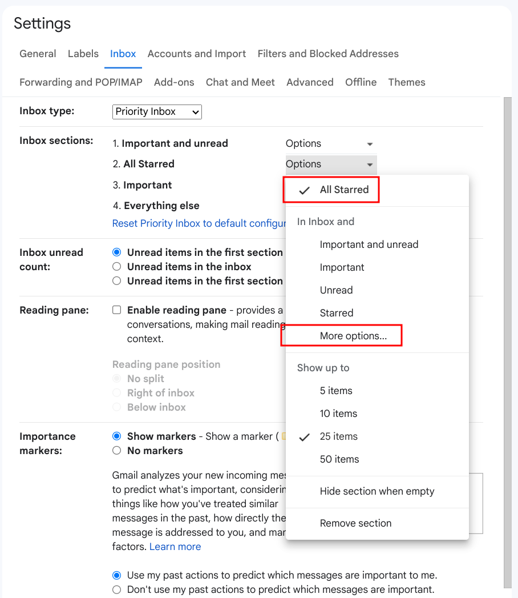
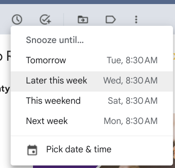
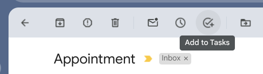
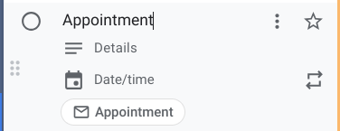

<!--
footer: 'bttk 2024'
--->

# Getting things done

with Gmail

These slides: https://bttk.github.io/gtd
Source code: https://github.com/bttk/gtd

---
<!--
header: 'Getting Things Done with Gmail'
-->

## Why get things done?

<!--
I used to deal with big volumes of incoming emails. Easily hundreds of messages during a workday.

Since my situation wasn't unique I have learned from my coworkers some tricks that are now applicable in my personal inbox (<100 messages/week).

Why do I like it?
- I execute the process when it works best for me.
- The rapid pace makes each step feel satisfying.
- It avoids the pitfals of notifications or missed emails.

-->

- Based on lessons learned when deailng with hundreds of incoming messages.
- In a daily or weekly session go through a batch of incoming messages.
    - No ongoing distractions.
    - No anxiety over missed emails.
    - A rapid pace makes process *satisfying*.

---
## The workflow

<!--
I prefer starting with the newest "important" emails.

I use gmail's stars ⭐ to mark my current context.
-->

Go through emails one by one. Ideally: **touch each email exactly once** and decide its fate:

1. Is it actionable?
    * **No**: Categorize and archive it.
2) Is it a single 2-minute action?
    * **Yes**: Do it now!
3) Is this a task for you?
    - **Yes**: Move to Todo.
    - **No**: Delegate and snooze.

---
## My Setup

1. Open the settings panel.
2. Select **Priority Inbox**.
3. Open **Customize**.

---

## Inbox sections

I use the following 4 sections:
1. Important and unread
2. **All** Starred
    - Including archived items. Look for it in *More options...*
3. Important
4. Everything else

---

## Snooze

Shortcut: `b`

When you're waiting for someone to get back to you, snooze it.

<!--
Make sure it doesn't slip through the cracks.
-->

---

## Todo
Shortcut: `Shift + t`

Tasks that need planning or more time go to the Todo list and the email gets archived.

The task will link back to the email.

<!--
You can also drag from the message list to the sidebar.
-->

---

## Speed up

Increase your pace by using keyboard shortcuts. You may need to enable shortcuts in settings first.

- `j`/`k` - Go to next/previous conversation
- `u` - Go to list of conversations
- `e` - Archive
- `s` - Star
- `b` - Snooze
- `Shift + t` - Create a Task
- `z` - Undo last action
- `?` - See all shortcuts
